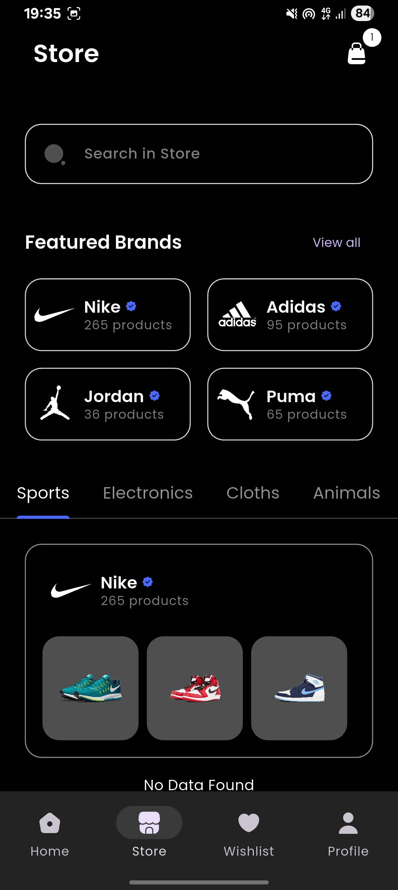
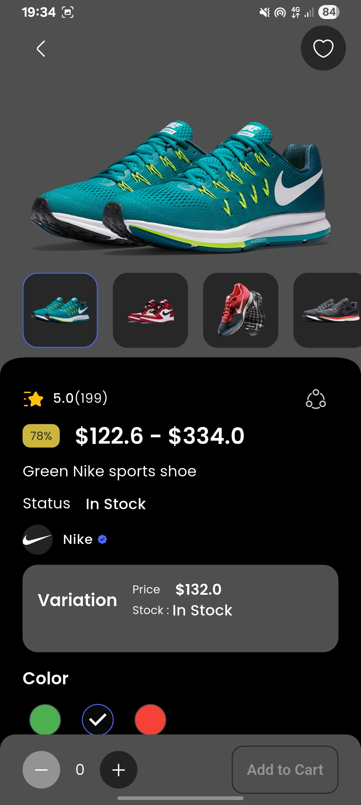
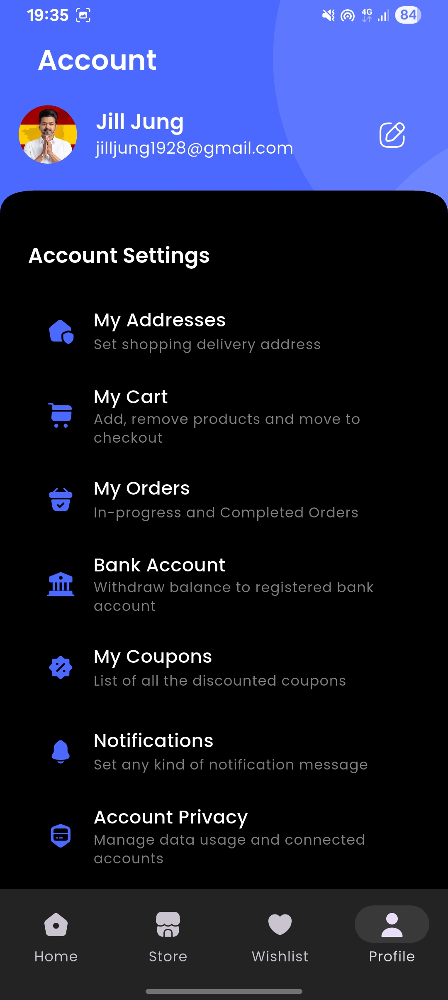
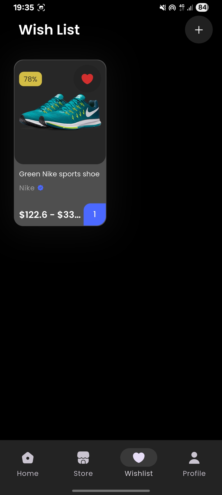

---

# 🚀 OrixOrix – Feature-Based Flutter Application

OrixOrix is a **robust, scalable mobile application** built with **Flutter**, following a **Feature-Based Architecture**.
It uses **GetX** for state management, routing, and dependency injection, **Firebase** for authentication and real-time database, and **Supabase** for high-performance image storage.

---

## ✨ Features

### 🔐 Authentication

* Email & Password authentication (Firebase Auth)
* Google Sign-In support
* Secure session handling with GetX

### 🔄 Real-Time Database

* Cloud Firestore integration
* Live data synchronization

### 🖼 Image Storage

* Supabase Storage for fast image uploads & retrieval
* Cached network images for performance

### ⚙️ App Capabilities

* GetX state management & navigation
* Internet connectivity monitoring
* Centralized error handling
* Scalable feature-based structure
* Dark and Light theme support

---

## 🛠 Tech Stack

| Category         | Technology           |
| ---------------- | -------------------- |
| Framework        | Flutter              |
| Language         | Dart                 |
| State Management | GetX                 |
| Navigation       | GetX                 |
| Authentication   | Firebase Auth        |
| Database         | Cloud Firestore      |
| Image Storage    | Supabase             |
| Connectivity     | connectivity_plus    |
| Image Caching    | cached_network_image |

---

## 📦 Main Packages Used

```yaml
get: ^4.x.x
firebase_core: ^2.x.x
firebase_auth: ^4.x.x
cloud_firestore: ^4.x.x
google_sign_in: ^6.x.x
supabase_flutter: ^2.x.x
connectivity_plus: ^5.x.x
cached_network_image: ^3.x.x
```

---

## 📂 Folder Structure (Feature-Based)

> Refactored structure based on the current repository and architecture image

```plaintext
lib/
├── main.dart
├── app_binding.dart
│
├── common/
│   ├── styles/
│   └── widgets/
│
├── data/
│   └── repositories/
│
├── features/
│   ├── authentication/
│   │   ├── controllers/
│   │   ├── models/
│   │   ├── views/
│   │   └── widgets/
│   │
│   ├── personalization/
│   └── shop/
│
├── routes/
│
└── utils/
    ├── constants/
    ├── device/
    ├── exceptions/
    ├── formatters/
    ├── helpers/
    ├── http/
    ├── local_storage/
    └── logging/
```

### ✅ Why this structure?

* Clear separation of **features**
* Easy to scale and maintain
* Business logic isolated from UI
* Reusable utilities & widgets

---


## 📱 Main Screens


| Login Screen                      | Home Screen                     | Store Screen                      |
| --------------------------------- | ------------------------------- | --------------------------------- |
| |  |  |


| Prduct Detail Screen          | Profile Screen                      |Wishlist Screen                     |
| ----------------------------- | ----------------------------------- |----------------------------------- |
|  |  | |


---

## ⚡ Installation & Setup Guide

### 1️⃣ Prerequisites

Ensure you have installed:

* Flutter SDK
* Git
* Node.js (for Firebase CLI)
* VS Code / Android Studio

---

### 2️⃣ Clone the Repository

```bash
git clone https://github.com/Vithu-29/Orix.git
cd Orix
```

---

### 3️⃣ Install Flutter Dependencies

```bash
flutter pub get
```

---

## 🔥 Firebase Setup (First-Time Users)

### Step 1: Install Firebase CLI

```bash
npm install -g firebase-tools
```

Verify installation:

```bash
firebase --version
```

---

### Step 2: Login to Firebase

```bash
firebase login
```

---

### Step 3: Install FlutterFire CLI

```bash
dart pub global activate flutterfire_cli
```

Ensure global pub cache is in your PATH.

---

### Step 4: Configure Firebase for Flutter

```bash
flutterfire configure
```

* Select your Firebase project
* Choose platforms (Android, iOS, Web if needed)
* This auto-generates:

  * `firebase_options.dart`
  * Platform-specific config files

---

### Step 5: Firebase Console Configuration

#### 🔐 Enable Authentication

* Go to **Firebase Console → Authentication**
* Enable:

  * ✅ Email/Password
  * ✅ Google Sign-In

#### 🔑 Google Sign-In (Important)

For **Android**, add SHA keys:

```bash
cd android
./gradlew signingReport
```

Copy:

* SHA-1
* SHA-256

Add them in:

> Firebase Console → Project Settings → Android App

---

#### 🗄 Enable Firestore

* Firebase Console → Firestore Database
* Create database
* Start in **Test Mode** (for development)

---

## 🖼 Supabase Setup (Image Storage)

1. Create a project in **Supabase**
2. Go to **Storage**
3. Create a **public bucket** named `images`
4. Copy:

   * Project URL
   * Anon Public Key

Create constants file:

```dart
// lib/utils/constants/api_keys.dart
class ApiKeys {
  static const String supabaseUrl = 'YOUR_SUPABASE_PROJECT_URL';
  static const String supabaseAnonKey = 'YOUR_SUPABASE_ANON_KEY';
}
```

---

## ▶️ Run the Application

Check devices:

```bash
flutter devices
```

Run app:

```bash
flutter run
```

---

## 🧠 Architecture Highlights

* **GetX Bindings** for dependency injection
* **Repository pattern** for data handling
* **Centralized exception handling**
* **Reusable UI components**
* **Feature isolation for scalability**

---

## 📌 Future Improvements

* Role-based access control
* Push notifications
* Offline Firestore persistence
* Unit & widget testing
* CI/CD with GitHub Actions


---

## ⭐ Support

If you find this project helpful, please ⭐ star the repository and share it!

---
